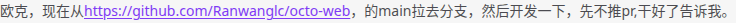

# GH1651 — Chat URL punctuation

Related issue: https://github.com/Mininglamp-OSS/octo-web/issues/1651

## Behavior

- Automatically detected HTTP(S)/www URLs leave sentence-final ASCII and Chinese
  punctuation outside the link, while preserving the full message text.
- Han characters and Chinese sentence punctuation also end bare URLs when prose
  follows without whitespace: `https://github.com/Ranwanglc/octo-web的main拉去分支`
  links only `https://github.com/Ranwanglc/octo-web`. Later URLs in the same sentence
  are still recognized. This is a chat heuristic: Chinese URL contents, including
  international domain names, require an explicit Markdown/angle-bracket link or
  an encoded URL (punycode for domain names) to express their full destination.
- Matched brackets inside a URL are preserved; unmatched enclosing closing
  brackets remain prose. Internal query punctuation and percent encodings stay intact.
- Explicit Markdown links, reference links and `<URL>` destinations are retained.
  Code is not linkified. When punctuation is intentionally part of the end of a
  URL, an explicit Markdown destination can express that intent.
- The same boundary policy applies to ordinary chat Markdown, rich-text blocks
  and reply previews. Markdown retains GFM's `http` scheme for www links.
- Copying a rendered automatic link back into the composer restores plain text,
  so edits to punctuation or surrounding prose are linkified again on render.
  Explicit Markdown links and external HTML links retain their destinations.
  Previously sent explicit links are not reinterpreted as bare URLs.

## Baseline and scope

At fork main `8d066a842068efb61a9a20580a0309256a1edd60`, the issue's
literal ASCII-comma example already passes isolated rendering tests. Reproduced
failures are Chinese punctuation entering ordinary-message hrefs and matched
right brackets being removed in rich-text/reply links. Chinese prose directly
after a bare URL can also be included in the destination without a separator. The
original example is retained as a regression case; reproducing the exact reported
production failure still requires its raw message and deployed version. No stored
messages or explicit destinations are rewritten by this change.

Copying a rendered automatic link can create a serialized
`[https&#58;//...](https://...%E7%9A%84...)` link. Editing its visible label can
then leave the original destination intact, including any incorrectly detected
prose. This copy/edit/send path needs to retain the original plain-text intent.
The renderer now marks automatic anchors with `data-octo-autolink="true"`;
the composer's HTML paste transform unwraps only those anchors before Tiptap
creates Link marks. Existing stored explicit messages need plain-text editing
or resending to change their destinations.

## Browser scenario

1. Use the local mock IM runtime and open the seeded test group.
2. Enter the original three-line example through the real composer.
3. Add a paragraph with Chinese punctuation and a URL with paired parentheses.
4. Add explicit Markdown and angle-bracket links ending in punctuation.
5. Add a URL immediately followed by Chinese prose and two URLs separated by prose
   without whitespace, plus an escaped math formula followed by a URL ending in
   Chinese punctuation. Send all paragraphs together.
6. Check final message anchors and the complete visible text, then click the
   GitHub link. Fulfill the destination locally, verify the popup URL
   is exactly `https://github.com/Ranwanglc/octo-web`, and save a screenshot.
7. In a separate conversation, send, select and copy a plain-text message
   using the browser clipboard, paste into the real composer, insert a comma
   after the URL, and send. Verify the pasted editor has no Link mark and the
   final anchor text/href exclude the comma and Chinese prose.
   The mock transport does not ACK sends, so this test reloads the composer
   between copying and resending; it retains the real browser clipboard.

Verified copy/edit/send result (only the URL remains linked):



## Verification

```bash
pnpm --filter @octo/base exec vitest run src/Messages/Text/__tests__ src/Utils/__tests__/linkify.test.ts src/Utils/__tests__/security.test.ts src/ui/message/ReplyBlock/__tests__ src/ui/message/MixedContent/__tests__ src/features/chat-composer/clipboard/__tests__ src/features/chat-composer/ui/__tests__/clipboardIntegration.test.tsx src/features/chat-composer/adapters/tiptap/__tests__/mentionSendParse.test.ts --maxWorkers=2
pnpm --filter @octo/web build:e2e
PW_PREVIEW_PORT=51651 pnpm --filter @octo/web exec playwright test --config=e2e-kit/playwright.ci.config.ts --grep @GH1651 --repeat-each=3 --workers=1
pnpm --filter @octo/web build
```

Follow-up validation on 2026-09-10: 481 unit/component tests passed; both browser
scenarios passed three consecutive runs (six passes); mock and production builds passed.
The full Web TypeScript check has existing errors. Comparing compiler diagnostics
against `90da878b` with the same configuration and dependencies found no new errors
(including comparison by file/code/message/count to account for shifted line numbers).
