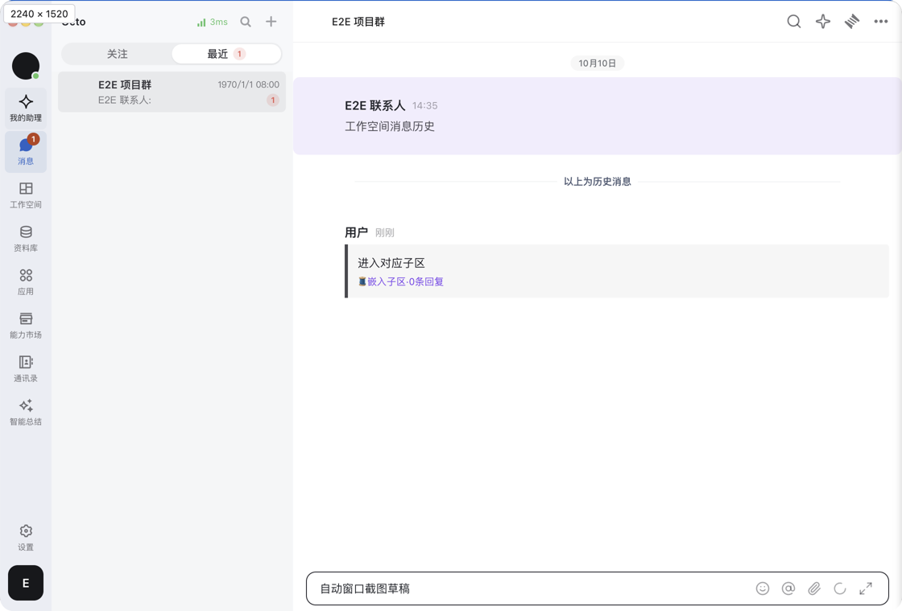

# OctoBuddy chat screenshots

## Behavior list

- Install one screenshot action only in the embedded communication entry and only when the host exposes a callable `captureScreenshot` capability.
- Ordinary browser chat and older hosts keep their existing toolbar and chat behavior.
- Capture appends one PNG to the original composer attachment queue; it never sends or replaces the draft. The capture is added through the `upload` attachment path, not `paste`: pasting inserts an inline editor node at the live Tiptap selection, which would replace selected draft text or an inline attachment.
- Hide the chat window only when the saved option is enabled. The preference is stored per user id, and is rebound on login and on `wk:auth-state-changed`, so an account switch cannot inherit the previous user's choice. Cancel on composer disposal or channel, space, or user changes and discard stale results.
- Bound every capture: a host that never settles is failed after 5 minutes and local cancellation releases the toolbar immediately, so the action can never stay disabled indefinitely. One PNG is limited to 32 MiB; larger captures report a dedicated `too-large` error instead of the generic failure.
- Show localized progress/errors. Unknown future host errors fall back to the generic screenshot failure message.

## File map

- `apps/web/src/client-communication/screenshot.tsx`: capability-gated registration and cleanup, called only from `mountUi.tsx`.
- `apps/web/src/client-communication/hostBridge.ts`: optional capture/cancel methods, with no required bridge version change.
- `packages/dmworkbase/src/features/chat-composer/screenshot/`: toolbar, acquisition lifecycle, preferences, `i18n/` translations, stories and tests. This belongs beside the existing composer features because it uses the conversation attachment queue. The translations live under `i18n/` and register the `screenshot` namespace, so `pnpm i18n:check` discovers them through `scripts/i18n-scan.mjs`.
- `packages/dmworkbase/src/Components/IconClick/index.tsx`: forward an optional accessible label only.

## PR scope

This PR supplies the embedded toolbar and attachment integration. The companion Client MR owns native acquisition, OS window boundary detection, selection/annotation, permissions, and IPC authorization. Browser entry points, server APIs, message transport, renderer contract version, artifact trust rules, and deployment pipelines are unchanged.

## Independent releases

| Runtime combination | Result |
| --- | --- |
| New Web deployed in a browser | No screenshot button or native bridge dependency; normal chat. |
| New embedded Web with an older Client | Missing capture capability means no button; normal chat. |
| New Client with the previous embedded Web artifact | Extra optional APIs remain unused; normal chat. |
| New Client with the new embedded Web artifact | Screenshot button, OS capture and PNG attachments. |

Either repository can merge/release first. The feature becomes available only when both the Client host and its loaded communication artifact support it. Deploying the website does not replace a Client's pinned embedded renderer; existing artifact preparation and integrity checks still apply. GitHub-to-GitLab test synchronization remains owned by the existing pipeline.

## Verification plan

- Unit tests: registration absent for old/malformed hosts, enabled for capable hosts, cleanup, cancellation/stale sessions, drafts/attachments, settings, unknown error fallback, a never-settling host, and the non-destructive `upload` attachment source.
- Real-composer regression: selected draft text and an inline attachment survive a completed capture (`screenshotDraftPreservation.test.tsx`).
- Run relevant embedded mount/bridge tests and `pnpm i18n:check`. The `screenshot` namespace is covered by the scanner: removing a key from either locale now fails the check.
- Build the standalone production Web entry and the embedded communication artifact; verify the screenshot toolbar is absent from the standalone output and from a browser chat.
- Use the companion Client integration suite against an isolated mock communication artifact to exercise bridge/attachment behavior and real desktop capture. Mock artifacts are test-only and never release inputs.
- The Client's macOS verification does not establish Windows execution or signed installer behavior.

## Visual evidence

Cropped embedded Client view during native window selection, using only the E2E mock conversation:

