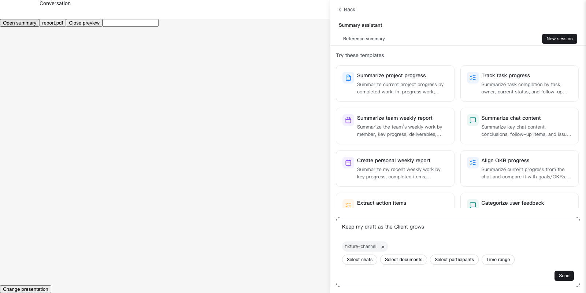
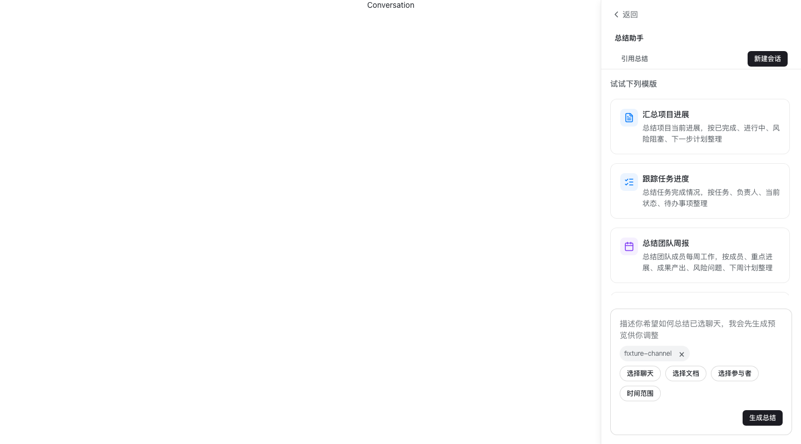

# Client Sidebar Layout

## Behavior And Scope

The existing chat summary entry keeps its list, create, detail and reference
flows. Summary uses the same split/overlay decision as other compact chat tools:
the conversation keeps at least 432 CSS pixels, and the panel gets at least 320.
Narrower content surfaces show the panel over the conversation without unmounting
either during resizing. Preferred summary width remains independent of thread
width and is not overwritten by window resizing or outward splitter drags that
cannot change the rendered width because the container is already at its limit.
Effective inward drags and later direction changes still update the preference.

Client conversation presentation hides the Web conversation list because the
native shell already supplies it. A retained WKLayout shell does not by itself
reserve navigation width: the shared observer only deducts the saved list width
when its direct list is displayed. It observes the list as well as the shell so
presentation changes re-evaluate the layout. Temporary `visibility: hidden`
navigation collapse still retains its normal budget to avoid layout oscillation.
Summary, search and compact threads can split at 752 pixels of actual content;
thread previews retain their 864-pixel threshold.

If a non-inline native attachment preview takes over while Summary is already
open, Summary is hidden without unmounting it. Closing the preview restores the
same draft in the current split/overlay layout. The visible Summary class and its
layout attribute share the same visibility condition. Inline previews and Web
fallback previews retain the existing panel-replacement behavior.

Workbench headers, composer controls and template grids respond to their own
container width, including ordinary Web and standalone Summary. Narrow reference
previews overlay the workbench below its header instead of taking 400 pixels
away from it. The existing close action returns to the unchanged draft.
The capability-gated legacy creation form also adapts its template columns;
its reference preview overlays the bounded agent area on narrow containers.

The unified reference overlay is at most 400 CSS pixels wide, bounded by the
workbench. Its top follows the actual header height through a ResizeObserver,
without requiring CSS anchor positioning. This replaces the former Client-only
token-derived width. Chat and participant selector overlays portal to the body
so containment does not confine them to a narrow workbench on older engines.

At ordinary heights the conversation and template list keep their own scrolling.
The workbench can also scroll vertically when the header and composer cannot fit
alongside a usable template viewport, including short landscape-sized Web windows.
Inline templates retain `max-height: none`; their grid responds to its container,
so a 640-pixel dialog uses two columns even in a wide browser window.

The panel back bar owns the native top band. Both embedded renderer entries load
the client-only Summary presentation styles. Browser bundles do not import them.
Search media keeps 104-pixel thumbnails and at most four columns, wrapping to
fewer columns when the actual content area is narrower.

No new entry, API, permission, host protocol or Client artifact pin is introduced.
This change does not build or publish an installer.

## File Map

- `packages/dmworkbase/src/Pages/Chat`: shared layout selection and panel bounds.
- `packages/dmworkbase/src/features/channelSearch`: media grid sizing.
- `packages/dmworksummary/src/components/ChatSummaryPanel.tsx`: back-bar marker and preferred width.
- `packages/dmworksummary/src/ui/SummaryWorkbench`: container-responsive workbench.
- `packages/dmworksummary/src/components/TemplateSelectorModal.css`: container-responsive templates.
- `packages/dmworksummary/src/index.css` and `components/SummaryReferenceSidePanel.css`: legacy entry sizing.
- `packages/dmworksummary/src/features/summaryWorkbench/SummaryWorkbenchFeature.css`: reference overlay.
- `apps/web/src/client-feature/desktop/summary.css`: shared client-only presentation.
- `apps/web/e2e-kit/fixtures/desktop-summary-sidebar.*`: real component fixture with isolated data.

## Verification

- Summary component tests cover navigation, desktop markers and width persistence.
- Chat layout tests cover split boundaries and summary open/close integration.
- Desktop browser regressions cover narrow/wide containers, ordinary Web,
  macOS/Windows geometry, references, draft preservation and media columns.
- Check both renderer builds and ordinary Web isolation before release.
- Native window-control hit testing and signed installers remain Client acceptance.

## Local Validation

Validated on 2026-09-21 from upstream base `52a25f8e`:

- 163 chat layout, file-preview, workspace-embedding and channel-search unit tests passed in the pre-PR rerun.
- 179 Summary component, workbench and workspace unit tests passed in the pre-PR rerun.
- 86 desktop browser regressions passed, including 31 new sidebar cases.
- Communication, Summary and ordinary Web builds passed with
  `VITE_API_URL=https://runtime-build.invalid`; client builds used
  `OCTO_ALLOW_DIRTY_CLIENT_ARTIFACT=1` for local-only validation.
- Ordinary Web output contains no desktop presentation selectors. The existing
  file-dialog `no-drag` rule is unrelated and remains unchanged.
- `pnpm i18n:check` and `git diff --check` passed. Scoped Stylelint reported
  zero errors and 24 pre-existing color warnings in the two legacy stylesheets.

Run the browser suite with:

```sh
pnpm --dir apps/web exec playwright test --config=e2e-kit/playwright.desktop.config.ts
```

The DEV-only fixture is `e2e-kit/fixtures/desktop-summary-sidebar.html`.
Query parameters cover `platform=darwin|win32|web`, `width`, `zoom`, `theme`,
`locale`, `history`, `legacy`, `standalone`, `fallback`, `media`, `host-preview`,
and `client-shell` (used with `host-preview`).
The host-preview mode uses the real ChatContentPage lifecycle, event handlers,
layout observer and rendered panel tree. It substitutes the conversation message
renderer and native bridge, while keeping the production Summary component.
Other modes stub data transport only. No backend or native Client is required.
The Client shell variant also mounts real WKLayout and WKViewQueue routes with
the shipped conversation-presentation CSS. It checks hidden versus visible list
ownership, split boundaries and repeated resizing without duplicating the
production layout attributes in the fixture.

## CI Startup

PR run `35575474231` passed the business and HTML-preview steps but failed
the first two Summary sidebar cases before rendering. The traces show a cold
dynamic module graph and a subsequent Vite dependency-optimization reload;
the five-second layout assertion expired before fixture bootstrap completed.

The desktop Vite configuration now discovers every desktop HTML fixture and
warms the Summary entry. Sidebar tests separately await a bounded fixture-ready
signal emitted after its first React commit, with bootstrap errors surfaced to
the test. Layout assertion timeouts, zero retries and the CI gate are unchanged.

After rebasing onto upstream base `e10cf94d`, all 342 targeted unit tests and
101 desktop browser tests passed locally on macOS. The full desktop run used
a new Vite cache, one worker and zero retries. It includes a regression that
holds the Summary module request, verifies the loading state, then releases it
and checks the rendered workbench. This does not replace the Ubuntu PR gate.

## Review Follow-Up

Review follow-up on 2026-09-21 reproduced the missing-anchor header overlap and
the inaccessible template list at 390 by 360 pixels before fixing them. An
isolated Electron 26.0.0 / Chromium 116.0.5845.82 process also reproduced the
chat-selector scrim being confined to 700 pixels within a 1200-pixel viewport.
After the fixes, its macOS/Windows/Web presentation fixtures passed reference
resizing and draft checks, and the Web scrim covered the full viewport.
This was an isolated compatibility harness, not installed-Client acceptance.

The follow-up passed 1717 Summary unit tests, 166 targeted chat/preview/search
unit tests and 108 desktop browser regressions with a fresh Vite cache and zero
retries. The desktop CI discovery floor now requires at least 108 passing cases.
New host-preview transition tests also assert that opening Summary clears the
accepted source and preserves the rendered split/overlay attributes, including
late acceptance after cancellation.
Ordinary Web, Client communication and Client Summary production builds also
passed; local Client builds used the dirty-artifact override for validation only.

The next review correctly identified the reverse ordering: Summary open first,
then a non-inline native preview is accepted. Two new transition cases and two
browser cases failed on `28b8882e` before the visibility fix. The browser fixture
now drives the real ChatContentPage events and verifies the panel is hidden,
the conversation occupies its full width, and the exact textarea node and draft
return after closing the preview, including a resize into overlay layout.
Inline and unsupported-fallback replacement paths remain covered.

The capped outward-drag regression also checks both the saved preference and
CSS variables, then widens the window to verify the 700-pixel preference returns.
Unit cases additionally cover consecutive gestures, an effective inward drag
after a no-op, and reversing direction within a single gesture.

This follow-up passed 1720 Summary unit tests, 170 targeted chat/preview/search
tests, all 111 desktop browser tests with a fresh Vite cache and zero retries,
and all three Web/communication/Summary production builds. The desktop discovery
floor is now 111. The modified Chat stylesheet has no Stylelint errors and eight
existing warnings; i18n and diff checks pass. Native authenticated acceptance
remains outside this verification.

## Client Shell Follow-Up

On 2026-09-22, a Client report exposed a gap in the fixture coverage: the
communication conversation surface keeps WKLayout but hides its Web list.
The previous observer still subtracted that list's saved 300-360-pixel width,
so a 1000-pixel surface with a 360-pixel list preference selected overlay
despite having enough room for both conversation and Summary.

Three new browser cases failed on upstream base `af73104f` before the observer
fix and passed afterward. They mount the real layout shell, keep the saved list
width, resize the content from 390 through 1600 pixels, and switch between
conversation and workspace presentation. They verify the 752-pixel boundary,
the visible conversation width, Summary draft preservation and unchanged saved
widths. This uses synthetic messages and a stubbed host bridge, not an
authenticated installed Client.

All 114 desktop browser tests passed with a fresh Vite cache, one worker and
zero retries. The 73 layout observer/decision tests, 101 targeted
chat/preview/WKLayout tests, 62 Client shell tests, ordinary Web build and both
Client renderer builds also passed. The desktop CI discovery floor is now 114.
Ordinary Web output still contains no desktop presentation selectors, and the
i18n and diff checks pass.

The 1600-pixel browser fixture below shows conversation space on the left and
the 700-pixel Summary on the right. The conversation controls are test substitutes;
the layout shell and Summary are production components.



## Visual Evidence

The 360-pixel sidebar below uses production components and the macOS desktop
presentation adapter with synthetic fixture data. It is a browser regression
screenshot, not a native Client acceptance screenshot.



An isolated native Client preview was also built with the local communication,
Summary and apps artifacts and reached the Aegis login screen. Authenticated
chat/sidebar behavior, native window-control hit testing and signed installers
have not been verified. Preview-only Client pin changes are outside this Web PR.
