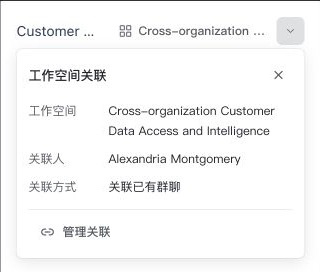

# Client Workspace Chat Entry

## Behavior List

- Show one split workspace entry beside a group conversation's title only when
  the embedded Client bridge supplies all workspace group methods.
- Standalone Web and older Clients remain unchanged. Direct chats, threads,
  and groups without a verified project relation have no entry.
- The name opens the Client workspace. The adjacent disclosure shows relation
  details and requests the Client's native relation-management overlay.
- Only group owners/managers who are also members of the linked Workspace may
  manage a relation. Workspace administration alone and being the original
  linking person do not grant that permission. Explicit API denial wins over
  roles, and unknown membership fails closed. System-managed
  all-member groups cannot be unlinked. Workspace access is independent of
  group membership.
- The Client derives the current authenticated Space and resolves the group
  relation on every consequential action; a renderer-supplied project ID is
  never authorization.
- Loading does not block chat. Failed actions expose retryable localized errors.
  Group/Space changes invalidate outstanding reads and actions.
- Closing management, host resume/focus, and relation-change notifications
  refresh the entry. Unlinking preserves the group, messages, and membership.

## File Map

Web:
- `packages/dmworkbase/src/features/workspaceGroup/`: capability contract and
  scoped React provider/container, with no Client runtime dependency.
- `packages/dmworkbase/src/ui/WorkspaceGroupEntry/`: token-based presentation
  and Story coverage, written before conversation wiring.
- `packages/dmworkbase/src/Pages/Chat/index.tsx`: title accessory integration
  only; no networking or Client-specific business logic.
- `apps/web/src/client-communication/`: optional bridge methods and provider
  adapter, including scope invalidation.
- `packages/dmworkbase/src/i18n/`: Chinese and English copy.
- Focused tests beside the new behavior and existing shell integration.

Client:
- `shared/workspace-group-contract.ts`: matching wire types.
- `electron/main/communication/`: trusted IPC and relation lookup/action
  validation, separated from existing orchestration files.
- `electron/communication-preload/` and `electron/preload/`: guest capabilities and narrowly allowlisted host
  navigation/management events.
- `src/renderer/src/features/projects/group-chats/`: reuse existing management
  dialogs and refresh notification.
- Application composition: wire workspace navigation and modal visibility.
- Focused unit, component, and E2E coverage.

## Bridge Contract

The bridge methods are optional and additive:

```ts
type WorkspaceGroupTarget = { channelId: string; channelType: 2 };
type WorkspaceGroupAction = WorkspaceGroupTarget & { projectId: string };
type WorkspaceGroupContext = WorkspaceGroupAction & {
  projectName: string;
  groupName: string;
  linkedByName: string;
  linkedAt?: string;
  manageDisabledReason?: "workspace_membership" | "group_role" | "system_group" | "denied" | "unavailable";
  source: "created_in_project" | "linked_existing" | "unknown";
  canOpen: boolean;
  canManage: boolean;
  isAllMemberGroup: boolean;
};

getWorkspaceGroupContext?(target: WorkspaceGroupTarget):
  Promise<WorkspaceGroupContext | null>;
openGroupWorkspace?(target: WorkspaceGroupAction): Promise<void>;
manageWorkspaceGroup?(target: WorkspaceGroupAction): Promise<void>;
onWorkspaceGroupChanged?(listener: (target: WorkspaceGroupTarget) => void):
  () => void;
```

Management resolves when the Client accepts the request; it does not imply a
mutation. The Client emits the changed event after management completes. Web
also refreshes on host visibility/resume and focus for compatibility.
The Client dialog shows the group, Workspace, linking person and recorded
relation time. Missing relation time is not replaced with group creation time.
The existing Workspace-side unlink action shares the same main-process guard.
Supported Clients keep the conversation visible behind a transparent native
overlay while blocking background input. Older hosts retain the inline fallback.
The enterprise DELETE endpoint must enforce the permission intersection and
system-group restriction atomically; Client checks do not replace server
authorization, which was not verified in this work.

## PR Scope

This work adds the Client-only workspace relation entry and the minimum
cross-repository bridge needed to operate it. It does not add standalone Web
workspace routes, modify message rendering, change membership rules, replace
workspace management, update artifact pins, package installers, or publish.
Shared Chat changes are limited to an optional title accessory.

## Verification Plan

- Web focused component/hook/shell tests: absent capability, group-only
  gating, missing relation, stale response suppression, permission states,
  action failure, relation refresh, and disposal.
- Story: light/dark, Chinese/English, long names, read-only/system-managed,
  loading, and errors, including narrow layouts.
- Client unit/component tests: payload and sender validation, authoritative
  project lookup, permission guards, stale session protection, host navigation,
  native management, and changed-event handling.
- Run Web i18n checks, Client typecheck, focused E2E where available, and
  `git diff --check` in both worktrees.
- Verify the primary path with the local preview and record any environment
  limitations separately from passing automated checks.

## Presentation

The entry reuses the Client navigation's `LayoutGrid` workspace icon. Group
title and workspace actions share a centered 28px row; the jump and disclosure
remain separate keyboard-accessible ghost buttons. Long names truncate without
losing their accessible label, and loading preserves the icon slot.

This 320px Story capture uses fixture names, not real conversation data:



## Verification And Rollout

Run the focused checks from the Web repository root:

```sh
pnpm --dir packages/dmworkbase test src/ui/WorkspaceGroupEntry src/bridge/workspaceGroup
pnpm --dir apps/web test src/client-communication/workspaceGroupHost.test.ts src/client-communication/CommunicationShell
pnpm exec stylelint packages/dmworkbase/src/ui/WorkspaceGroupEntry/index.css --config stylelint.config.mjs
pnpm i18n:check
git diff --check
```

The actual test-environment Client was inspected with API/IM mocks disabled.
Checks covered the workspace header, native management, preserved chat
background, blocked background clicks, confirmation, cancellation, Escape and
focus restoration. No real relation was unlinked. Story coverage includes
light/dark themes, Chinese/English and narrow long-name layouts.

After the native overlay rewrite and mainline rebase, all four selected
companion Client Electron tests passed with freshly built isolated fixtures.
They cover the entry's workspace jump, native management, cancellation,
confirmed unlink and draft preservation, plus group-list layout/navigation
and link-dialog validation. Entry layout checks cover 1440x900, 1120x760,
900x700 and 760x800; the fixture temporarily lowers the native minimum width.
Full repository typechecks/component suites have previously observed baseline
failures and are not claimed as clean. See the PR for current focused results.

Deployment requires the matching Client bridge and publication of the Web
communication artifact through the normal pinning workflow. This change does
not alter release pins or installer resources.

Native surface suspension and host-window visibility are tracked separately.
Showing the host window cannot reactivate a suspended chat or a revoked
session; duplicate visibility events do not close the relation disclosure.
