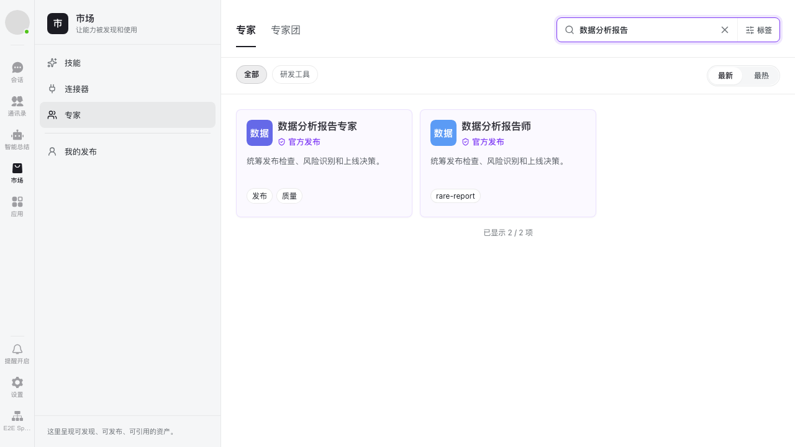
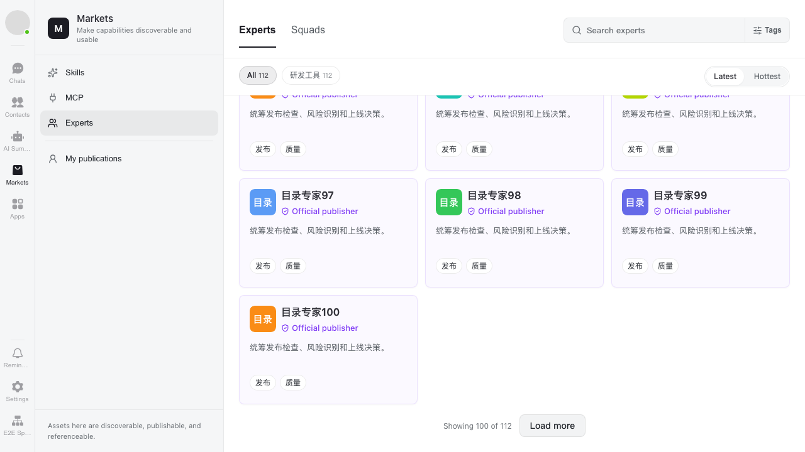

# Expert catalog search and pagination (#81)

## Behavior list

- Existing expert market and My publications entries remain the only entry points.
- Search names, categories, and AND-combined tags on the server before pagination.
  Debounce keyword input; reset to page 1 on filters, sort, kind, or Space changes.
- Load more experts/squads, including personal publications, using backend totals.
  Keep existing rows when a later page fails and allow retrying that page.
- Use the scoped tag catalog instead of deriving options from the first list page.
  Search tag names server-side before the suggestion limit; retain selected tags
  and keep tag loading/failure/retry independent from the asset list. Bound
  selected tags to the API's maximum of 20.
  Hide category counts during keyword/tag searches because the API does not return
  filtered category counts. Never calculate global counts from a loaded slice.
- Preserve detail, publish, edit, delete, and Loop flows. Ignore stale responses
  after filter/Space changes and unmount. All requests use existing authentication.

## File map

- `packages/dmworkmcp/src/bridge/useExpertCatalog.ts`: list state, debouncing,
  paging, metadata, stale-response protection, and reload/retry actions.
- `packages/dmworkmcp/src/bridge/useExpertTags.ts`: scoped server-side tag search,
  debounce, stale-response protection, and independent suggestion retry.
- `packages/dmworkmcp/src/pages/ExpertMarketListPage.tsx`: connect existing UI to
  the bridge; reuse WKButton for pagination, without a new reusable UI component.
- `packages/dmworkmcp/src/api/expertService.ts`: retain the existing HTTP boundary;
  scope tag options to mine/default scene and align mock name-search semantics.
- `packages/dmworkmcp/src/i18n/{zh-CN,en-US}.json` and `src/index.css`: pagination
  copy and token-based layout.
- Bridge/page and service tests: search beyond page 1, parameter forwarding,
  pagination, resets, races, failures, and independent personal lists.

## PR scope

Fix the expert catalog's first-page-only search and browsing. Ownership stays in
the existing dmworkmcp expert feature; shared components, routing, authentication,
Skill/MCP listings, backend endpoints, CLI, and deployment are out of scope.
Search follows the unified backend's name-only semantics.

## Verification plan

- `pnpm --filter @dmwork/mcp test` (focused regression tests first).
- `pnpm --filter @octo/web build` and TypeScript diagnostics for touched files.
- `pnpm i18n:check` and `git diff --check`.
- Verify Chinese/English pagination layout with existing page styles; inspect
  keyword search, load more/retry, kind and Space switching, and mine variants.
- Reproduce 112 catalog entries with matches at positions 66 and 112: search must
  return both on page 1, and unfiltered browsing must reach all 112 via page 2.

## Validation results

- MCP package: 23 test files, 275 tests passed.
- Web production build and local E2E build passed.
- Expert browser suite: all 6 cases passed three consecutive runs (18 passed,
  one worker, no retries), including Chinese and English search/pagination,
  rare-tag search beyond 50 suggestions, detail, empty search, and server failure.
  Command from `apps/web`: `PW_PREVIEW_PORT=5187 pnpm exec playwright test
  --config=e2e-kit/playwright.ci.config.ts e2e-kit/tests/experts
  --repeat-each=3 --workers=1`.
- `pnpm i18n:check` and `git diff --check` passed.
- Standalone package TypeScript checking needs the web app's installed type
  roots and still reports existing dependency/project errors. Compiler comparison
  against the worktree base reports 2,100 diagnostics both before and after,
  with no new diagnostics; changed TypeScript files have no diagnostics.

## Screenshots

Local mock catalog with 112 records; no production user data.

Chinese name search finds both matching records, including the one beyond page 1:

English pagination shows the loaded count and an action to load the remaining records:

