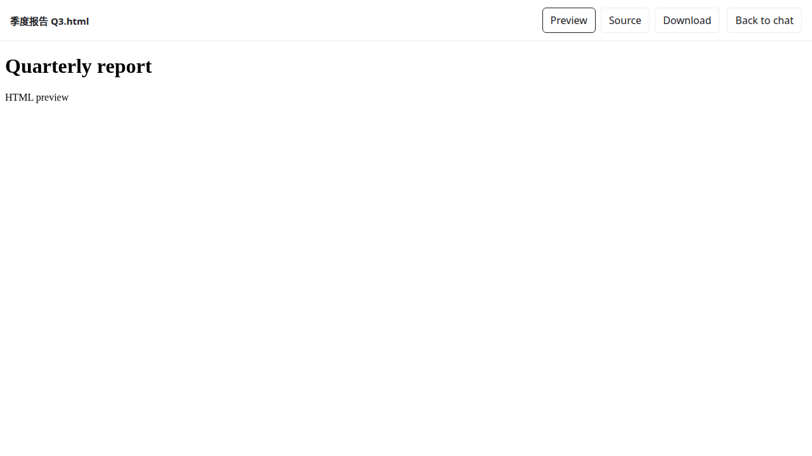
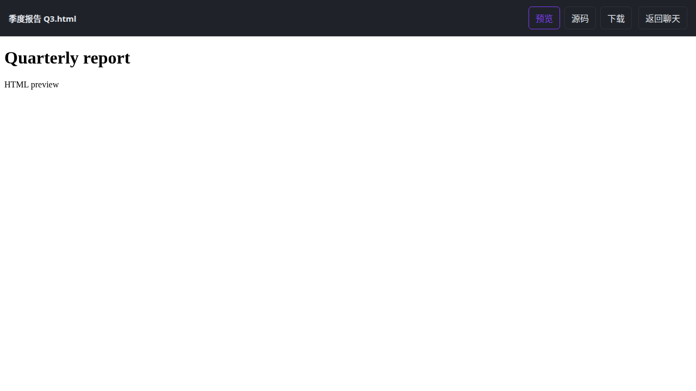

# HTML attachment preview (#1665)

## Behavior

The existing Web HTML/HTM open button opens `/file-preview#id`, a temporary,
same-origin sandbox preview. Refresh and closing the source tab remain supported.
The URL is not a share link. Missing or expired session context shows a terminal
message. No new navigation/menu entry is added. Desktop keeps its existing paths.

Downloads through these Web HTML actions preserve the original bytes and filename.
Read at most 20 MiB (including
unknown or incorrect size metadata); larger/unreadable attachments use the existing
signed download endpoint with an explicit filename. Signing errors are visible and
never fall back to a raw object URL.

Chat tabs restored from localStorage can preview, open and download attachments
without sessionStorage credential copies. The active session ID must still match;
present but mismatched copies and localStorage revocation reject access.
An endpoint-specific signing 401 fails only that operation with a retry message.
The next user attempt checks the live session again. It does not invalidate other
attachments or delete the standalone descriptor, so retry and reload can recover.
Actual logout or changed session ownership still clears access and cancels work.

## File map

- `Service/AttachmentFileService.ts`: signed URL boundary, no WKApp dependency.
- `features/html-attachment`: attachment references, browser handoff, runtime adapter.
- `bridge/html-attachment`: bounded reads, cancellation and download state.
- `ui/HtmlAttachmentPreviewPage`: standalone UI and Stories.
- `apps/web/src/index.tsx`: select preview bootstrap before importing chat startup.
- Existing message/search/preview adapters: preserve source/download references and
  route only Web HTML actions through this feature.

## PR scope

One Web fix, including HTML shared-component compatibility. No server changes,
storage migrations, global download rewrite, sandbox relaxation, or desktop window
redesign. Current OSS nginx already serves SPA paths; deployments without that
fallback must serve index.html for the exact `/file-preview` path.

## Verification

Focused Service/bridge/component checks plus real browser preview/download checks:
attachment + octet-stream, Chinese filenames and original bytes, refresh/source-tab
closure, source mode, session invalidation, popup blocking, size/network failures,
file switching, explicit callbacks and non-HTML/desktop behavior. Build the Web host,
run i18n validation and inspect the new Story in light/dark and both languages.

The browser spec lives in `apps/web/e2e-kit/standalone/html-attachment`, outside
the production-preview suite's `tests` directory: its source-tab fixture requires
Vite's development transform and is not emitted into `build-e2e`. The PR e2e job
runs `playwright.html-preview.config.ts` in a separate mandatory step and requires
at least nine passes with no skipped or flaky cases. JSON results and traces are
included in the existing Playwright report artifact.

The standalone bootstrap deliberately does not register chat modules or call
WKApp.startup, connect IM, sync contacts, or start summary polling. Session scope is
handed off in the destination sessionStorage, never in the URL. The descriptor has
no token or HTML body. Storage changes and foreground/action checks invalidate a
copied session after logout. Attachment scripts remain in `sandbox=allow-scripts`.

### Completed checks

- `pnpm --dir apps/web build`: passed.
- `pnpm i18n:check`: passed.
- Scoped preview CSS stylelint: passed. `pnpm lint` exits successfully but the
  workspace currently defines no runnable lint tasks, so it is not evidence of
  TypeScript/JavaScript lint coverage.
- Focused base Service/bridge/preview/message/search regressions: 17 files,
  101 tests passed. Existing host module-wiring checks: 3 files, 23 tests passed.
- `pnpm --dir apps/web exec playwright test --config e2e-kit/playwright.html-preview.config.ts`:
  all 9 Chromium scenarios passed. Responses are synthetic, including an actual
  cross-origin HTTP redirect, attachment disposition headers, localStorage-only
  login restoration, and signing-401 retry/reload with an unchanged login token.
- The production-preview CI suite (`playwright.ci.config.ts`) passed all 176
  cases against `build-e2e`; the workflow's full-suite gate reported zero failures,
  skipped cases and proxy errors. The separate HTML CI step passed its six-case,
  no-skip/no-flake guard. Workflow actionlint 1.7.12 also passed.
- `pnpm --dir apps/web exec vitest run --config vitest.storybook.config.ts ../../packages/dmworkbase/src/ui/HtmlAttachmentPreviewPage/HtmlAttachmentPreviewPage.stories.tsx`:
  5 Stories passed; English/light and Chinese/dark browser captures were inspected.
- Local production smoke: served the built assets through the existing nginx
  template (local port and upstream substitutions only). Verified SPA fallback,
  real CSP headers, refresh, sandbox, original filename/bytes, dark-mode canvas,
  and absence of chat bootstrap script/API requests.

Full Web TypeScript checking is not green on the clean base either. A comparison
against `03b64e2c` produced 2,666 baseline diagnostics versus 2,672 with this change;
new `FileCell` usages encounter the same existing React base-class props/state
incompatibility. No diagnostics referenced the new HTML Service, bridge, feature,
UI or bootstrap files in that comparison. This is not a clean typecheck result.

Live deployment URLs, object storage configuration and real authenticated
production downloads were not exercised. The fallback relies on the existing
server signer honoring `filename` and `disposition=attachment`.

