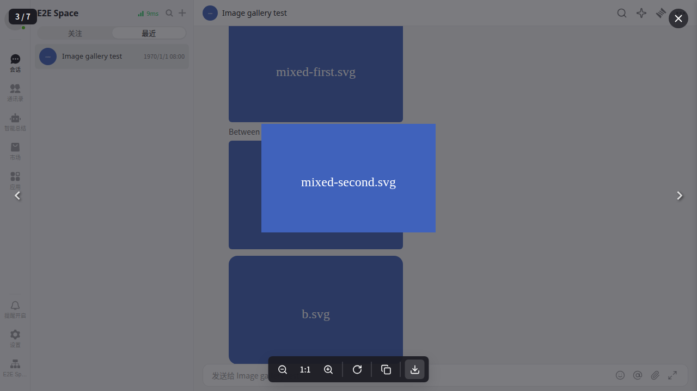

# Rich-text images in the conversation gallery

## Behavior list

- Clicking an image block in a RichText (type 14) message opens the existing conversation gallery at that exact block. Ordinary image messages and rich-text image blocks share message order, with blocks ordered as displayed.
- The same behavior applies to each displayed merge-forward level, including archives without message IDs. Conversation/Space and forwarding scopes remain independent.
- Preserve the existing loaded-message snapshot, unavailable-transfer/revocation/deletion/burn exclusions, per-image download filename, and URL safety checks. Selection mode must not open a preview. Standalone rich-text rendering retains single-image preview.

## File map

- `features/conversation-image-gallery/imageGallery.ts`: collect rich-text image blocks with original block indices and existing eligibility rules.
- `bridge/message/richTextMessageImages.ts`: pure extraction of rich-text image metadata.
- `bridge/message/useRichTextMessageUI.ts`: retain original image block indices in UI data.
- `Messages/RichText/index.tsx` and `Components/MergeforwardMessageList/index.tsx`: connect existing image clicks to the owning gallery.
- `ui/message/MixedContent/index.tsx` and `Messages/Text/MarkdownContent.tsx`: optional preview callback, retaining standalone behavior.
- Collector/component tests and `apps/web/e2e-kit/tests/chat/C1661-image-gallery.spec.ts`: verify ordering, exact clicked-image identity, navigation, filenames, scopes, and exclusions.

## PR scope

Extend the existing image gallery to structured rich-text image blocks. No new UI, routes, APIs, dependencies, sending protocol, or storage changes. Shared message rendering and the optional preview callback retain their existing default behavior. Markdown text-message images, file attachments, and standalone GIF messages remain outside this change.

## Verification plan

- Run focused base tests for the gallery, rich text, mixed content, Markdown image preview, ordinary image messages, and merge-forward rendering.
- Run actual-chat Playwright gallery cases with synthetic image/storage responses, covering clicks on rich-text blocks, both navigation directions, exact counts, current filename, and independent forwarded galleries.
- Run the Web production build, `pnpm i18n:check`, and `git diff --check`.
- Review the final diff and record actual results before opening the PR.

## Verification results

- 98 base tests across 13 files passed, including collector ordering/exclusions, exact repeated-URL block selection, selection mode, revocation, standalone fallback, and ID-less forwarded archives. Four new collector assertions failed on the unchanged base before the implementation.
- All 7 actual-chat gallery browser cases passed on the rebuilt E2E bundle, with zero skipped/flaky/failed cases and no proxy errors. The two new cases exercise rich-text navigation and nested forwarding; existing image upload/ACK/retry cases also pass. HTTP/IM boundaries use synthetic fixtures.
- Web production and E2E builds, `pnpm i18n:check`, and `git diff --check` passed.
- A compiler-host comparison against base `5396a1d2`, using Web compiler options and the changed production files as roots, reported 26 diagnostics in affected files before and after, with zero introduced diagnostics. This is a scoped comparison; the existing repository-wide typecheck is not claimed green.
- Inspected the browser screenshot below. This change reuses the existing viewer and adds no UI component, CSS, or translated copy.



Reproduce:

```bash
pnpm --dir packages/dmworkbase exec vitest run \
  src/features/conversation-image-gallery src/Messages/RichText src/Messages/Image \
  src/Messages/Text/__tests__/MarkdownImagePreview.test.tsx src/ui/message/MixedContent \
  src/bridge/message/__tests__/useRichTextMessageUI.test.ts \
  src/Components/MergeforwardMessageList
pnpm --dir apps/web build:e2e
PW_PREVIEW_PORT=5187 pnpm --dir apps/web exec playwright test \
  --config=e2e-kit/playwright.ci.config.ts C1661-image-gallery
pnpm --dir apps/web build
pnpm i18n:check
git diff --check
```
