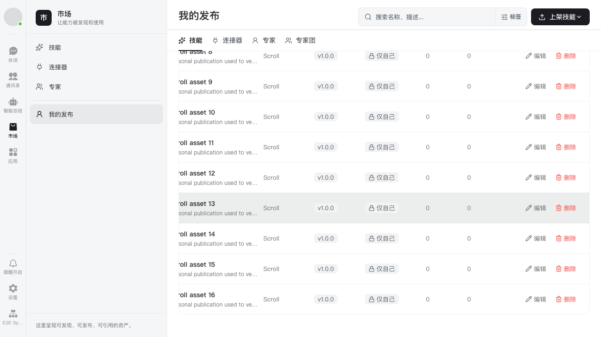
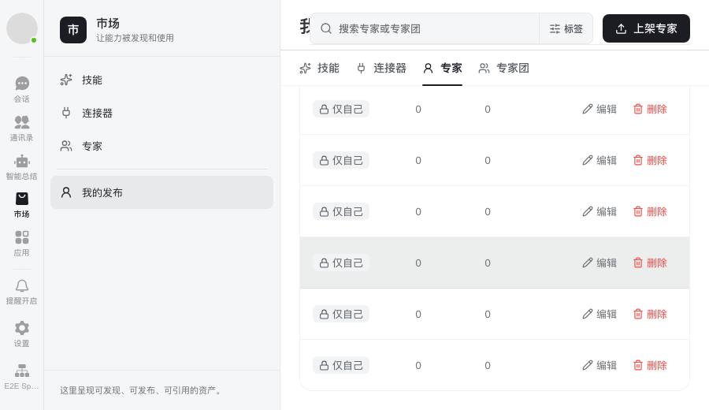

# My publications scrolling (#85)

## Behavior list

- Keep all four existing My publications tabs and actions.
- Long tables must retain their content height so the page's content area scrolls
  vertically by wheel/trackpad. Narrow tables must expose horizontal scrolling
  rather than clip the actions column.
- Opening and closing a dialog must preserve usable list scrolling. No changes
  to authentication, Space access, navigation, or list API behavior.

## Diagnosis

The skill list content is a column flexbox. Its direct child `MineTable` defaults
to `flex-shrink: 1`, and `overflow: hidden` allows its automatic minimum height to
collapse. In a 1280×720 browser, the table shrinks to 545 px although its content
is 3986 px tall. The outer list remains 611 px tall with scrollHeight=611, so wheel
input leaves scrollTop=0. The same table also clips columns (874 px clientWidth
versus 946 px scrollWidth). Expert/connector list wrappers do not trigger the
vertical shrink, explaining why other lists can appear normal.

## File map and scope

- `packages/dmworkskillmarket/src/index.css`: fix the shared MineTable's flex
  sizing and horizontal overflow, retaining the existing vertical page scrollers.
  Keep each row at least its grid's intrinsic minimum width so borders and
  backgrounds span the action columns when scrolled horizontally.
- Browser fixture and regression spec under `apps/web/e2e-kit/`: exercise actual
  My publications pages with enough server-provided rows to overflow the viewport.
- Shared impact: the table is reused by personal skills, connectors, experts,
  and squads. Discovery cards, global layout and WKModal remain unchanged.
- No new UI component or user-visible copy; no new Story is needed.

## Verification plan

- Reproduce the regression before the fix using real wheel input and mocked
  API rows, without inserting or resizing DOM nodes in the regression test.
- Verify all four personal lists at normal and small viewport sizes, including
  scrolling to the last row and its actions, upward scrolling, and dialog close.
- Run the affected package tests, relevant browser cases, production build,
  `pnpm i18n:check`, and `git diff --check`.

## Validation results

- Before the fix, the real-page regression with 16 server-provided skill rows
  fails: wheel input leaves scrollTop=0.
- Final verification was run in the independent #85 worktree, based on
  `upstream/main` at `6a2368c31cb3b4e9e9820533c2408179a9692b1a`, without the
  expert search/pagination changes for #81.
- All 8 Chromium browser cases passed three consecutive runs: **24 passed**
  in 59.4 seconds, with one worker and no retries. The cases cover all four
  personal-asset types at 1280×720 and 900×520. Each reaches the last row/action
  via wheel input, opens/cancels a delete dialog without deleting data, and
  scrolls back up with small deltas.

| Command | Result |
| --- | --- |
| `pnpm install --frozen-lockfile` | Exit 0; lockfile unchanged |
| `pnpm --filter @dmwork/skillmarket test` | Exit 0; 14 files / 136 tests passed |
| `pnpm --filter @octo/web build` | Exit 0 |
| `pnpm --filter @octo/web build:e2e` | Exit 0 |
| From `apps/web`: `PW_PREVIEW_PORT=5188 pnpm exec playwright test --config=e2e-kit/playwright.ci.config.ts e2e-kit/tests/market/MY1-my-publications-scroll.spec.ts --repeat-each=3 --workers=1` | Exit 0; 24 passed |
| `pnpm i18n:check` | Exit 0; no new candidates, locale keys healthy |
| `git diff --check` | Exit 0 |

Production and E2E builds emit existing warnings for third-party `eval` and
modules with both static and dynamic imports; these files are outside this
CSS-only runtime change. Installation reports dependency build scripts disabled
by the existing pnpm policy; all verification above still completed successfully.

## Screenshots

These screenshots come from the independent #85 Chromium run, using only local
mock records. Both were visually inspected. The tables have been scrolled right
to expose the action columns, so the leftmost name columns are outside the view.

Skills at 1280×720, scrolled to the final row:

Experts at 900×520, scrolled horizontally to the action columns:

