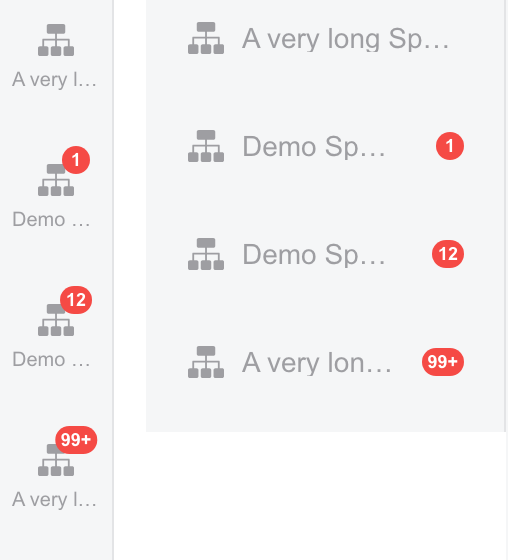

# Cross-space unread badges

The shared host NavRail space switcher uses a 14px-high badge with 9px text and
3px horizontal padding. Counts above 99 display as `99+`.

- Collapsed sidebar: the badge is centered on the icon's upper-right corner.
- Expanded sidebar: the badge stays right-aligned and vertically centered.
- Long Space names truncate with an ellipsis, including when there is no unread
  message. The button's native hover title retains the complete name.
- Unread badges have reserved space so the name cannot cover the digits.
- The visible badge is hidden from assistive technology; the button's accessible
  label already includes the unread count.

The sidebar width, label font size, and label starting position are unchanged.

## Screenshot

The real `NavSpaceSwitcher` Story below uses fixture data. The left column is
collapsed; the right column uses the production 180px expanded width. Rows show
counts 0, 1, 12, and 99+, including long names with and without unread messages.



## Regression checks

The existing CI `@octo/base` unit-test/coverage job runs `collapsedLayout.test.ts`.
It matches complete CSS selectors and checks both badge anchors, label truncation,
and the space reserved for unread digits. Exact rule lookup matters: a descendant
selector ending in `.wk-navrail__item-label` must never substitute for that base
selector or its source-order position in the dual-span label guard.

The Chromium Story additionally verifies rendered dimensions, positioning, text
overflow, and hover titles. Run it explicitly from `apps/web`:

```sh
pnpm exec vitest run --config vitest.storybook.config.ts ../../packages/dmworkbase/src/Components/NavRail/NavRail.stories.tsx
```

These browser assertions complement the CSS checks; the Story suite is not run
by the current CI workflow.
