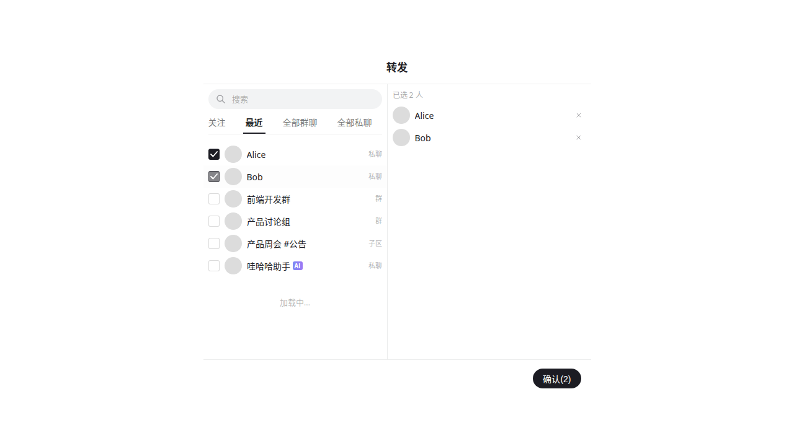
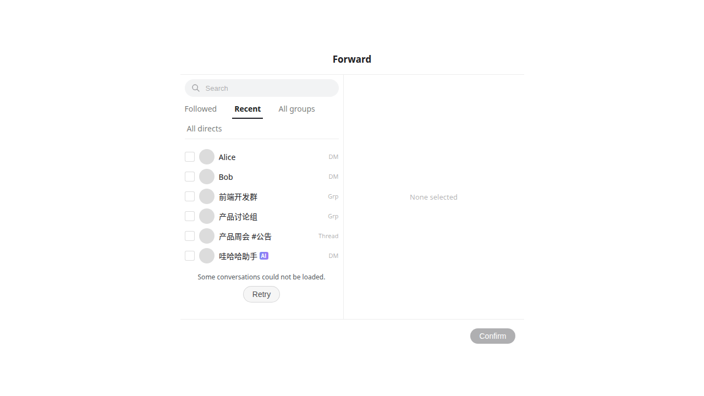

# Forward picker loading

`ConversationSelect` is the existing entry shared by message and document forwarding.
The picker assembles local IM conversations, fallback groups, people, and the authoritative
Followed/Recent sidebar scopes. Loading one source must not hide candidates from another.

- Groups and people start concurrently. Each source exposes its own loading, failure, and retry state.
- Followed and Recent publish independently. Until a tab's scope is known, arbitrary local
  conversations must not be shown as members of that tab.
- Available rows remain selectable while the remaining sources load. Empty state is only shown
  after the active tab's sources settle successfully; a failed source offers retry.
- Same-scope `conversation-list-refreshed` events rebuild local candidates without restarting
  every remote list request. Selection remains stable while candidates are added.
- Successful remote results are reused for 30 seconds across picker remounts; in-flight requests
  coalesce. Each source retains at most one account/session/Space/device snapshot. Nothing is
  persisted, failures are not cached, and expired snapshots are revalidated on the next mount.
- Scope changes immediately hide old candidates, search results, and selection. Late results
  cannot update the new scope. The in-memory scope key includes credentials and must never be
  logged or persisted.

## Validation

```sh
pnpm --filter @octo/base test src/Components/ForwardModal src/Components/ConversationSelect src/Components/WKBase
pnpm i18n:check
pnpm --filter @octo/web build
```

The loading regressions cover independent tabs, concurrent requests, partial errors and retry,
local refresh, selection preservation, scope changes, cache expiry and coalescing, and late
responses after unmount. `LoadingWithCandidates` and `PartialLoadFailure` demonstrate the
progressive states in Storybook; check both locales and themes.

For a real server comparison, record the two `sidebar/sync` requests, `group/my`, Space members,
and `friend/sync`, together with the first visible candidate on first open and same-Space reopen.
Controlled response tests verify ordering, not production latency.

## Screenshots

Storybook fixtures: available conversations remain selectable during loading, and partial failures expose retry.




